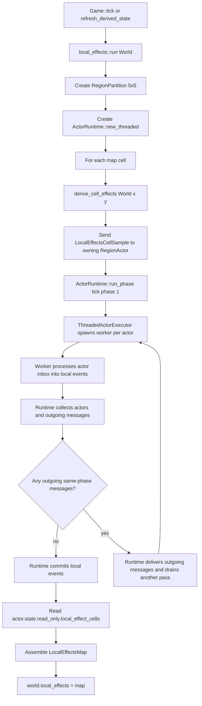
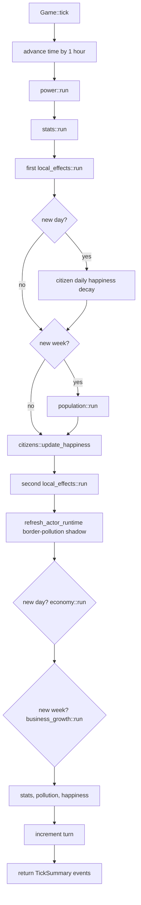
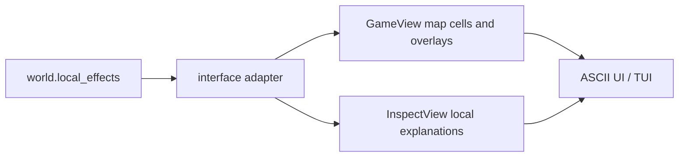

# Local Effects On The Region Actor Threading Model

## Purpose

This document explains how the current local-effects system uses the new region
actor runtime, how actor messages and events move through worker execution, and
how `Game::tick()` and UI-safe views retrieve the final data.

The current implementation is intentionally conservative:

- The ECS `World` remains owned by `Game`.
- UI still reads only `GameView` / `InspectView`.
- Region actors do not expose ECS internals.
- Threading happens behind `ActorRuntime`.
- Local-effects output is deterministic and has a direct fallback path.

## Terms

`RegionPartition`
: Splits the map into stable rectangular regions. Current local effects use
`5x5` actor regions.

`RegionActor`
: Owns an inbox, staged local events, and committed read-only derived state for
one region.

`RegionMessage`
: Input work addressed to one region actor for one `(SimTick, SimPhase)`.
Messages can be delivered by the runtime and processed by worker threads.

`RegionEvent`
: A local staged commit record created while an actor processes messages. Events
are not sent as standalone cross-thread messages. In threaded execution they
stay inside the owned `RegionActor` clone that is returned to the runtime, then
the runtime commits them into actor state at the phase boundary.

`LocalEffectsCellSample`
: A message containing one cell coordinate and its already-computed
`LocalEffects` result.

## Current Local-Effects Responsibility Split

The current system still computes the actual formula in
`src/core/systems/local_effects.rs`.

The actor runtime is used to prove region ownership, worker execution, stable
message ordering, and deterministic collection. It does not yet move ECS reads
inside actors.

```text
ECS World
  buildings, positions, citizens, grid
      |
      | derive_cell_effects(world, x, y)
      v
LocalEffectsCellSample messages
      |
      v
Region actors
  stage CommitLocalEffectsCell events
      |
      v
Actor read_only.local_effect_cells
      |
      v
World.local_effects
```

That means this mission converted the collection/execution shape first. A later
mission can move more real region-owned data into actors if measurements show the
message overhead is worth it.

## Local-Effects Data Flow



## Message And Event Flow Across Threads

The runtime sends messages before workers start. Each worker receives an owned
clone of one `RegionActor` for the current phase. The worker processes the actor
inbox and returns the actor plus any outgoing messages.

```mermaid
sequenceDiagram
    participant Game
    participant Runtime as ActorRuntime
    participant W1 as Worker thread: Region 0
    participant W2 as Worker thread: Region 1
    participant Actor as RegionActor

    Game->>Runtime: send LocalEffectsCellSample messages
    Game->>Runtime: run_phase(tick, phase)
    Runtime->>W1: cloned RegionActor 0 with inbox
    Runtime->>W2: cloned RegionActor 1 with inbox
    W1->>Actor: process_inbox_to_local_events
    W2->>Actor: process_inbox_to_local_events
    Actor-->>W1: staged CommitLocalEffectsCell events
    Actor-->>W2: staged CommitLocalEffectsCell events
    W1-->>Runtime: actor + outgoing messages
    W2-->>Runtime: actor + outgoing messages
    Runtime->>Runtime: sort actors and outgoing messages
    Runtime->>Runtime: commit_local_events at phase boundary
    Runtime-->>Game: completed phase statuses
```

Important detail: `RegionEvent` is not the cross-thread communication format.
The cross-thread input/output boundary is:

```text
PhaseWork {
  tick,
  phase,
  actors: Vec<RegionActor>
}

PhaseResult {
  actors: Vec<RegionActor>,
  outgoing: Vec<RegionMessage>,
  statuses
}
```

Inside each returned actor, local events are staged. The runtime commits them
only after the same-phase message drain is complete.

## Why There Are Messages And Events

Messages and events solve different problems.

Messages:

- address work to a target region
- carry `tick` and `phase`
- can cross actor/thread boundaries
- are sorted by tick, phase, source, and sequence
- may generate outgoing messages

Events:

- are local to one actor
- stage state changes before commit
- are sorted before commit
- are the only path from processed messages into actor state
- keep phase commits deterministic

For local effects, one cell becomes:

```text
RegionMessageKind::LocalEffectsCellSample(cell)
  -> RegionEventKind::CommitLocalEffectsCell(cell)
  -> actor.state.read_only.local_effect_cells
  -> world.local_effects
```

## Tick Integration

`Game::tick()` currently calls `local_effects::run()` twice.



The two local-effects passes have different purposes:

1. First pass: refreshes desirability/accessibility before weekly population
growth reads desirability. It runs after power and stats in the tick order, but
the local-effects formula itself reads grid/building/citizen data rather than
power or stats output.
2. Second pass: refreshes local effects after citizen happiness updates, because
nearby happy/unhappy citizens affect land value and pollution pressure.

After the second pass, `world.local_effects` is the final local-effects map for
the rest of the tick.

## UI Data Retrieval

The UI never reads actor state or ECS internals.



The retrieval path is:

```text
Game::view()
  -> view_world(&world)
  -> GameView
  -> UI render

Game::view_with_overlay(...)
  -> view_world_with_overlay(&world, overlay)
  -> GameView with overlay cells
  -> UI render

Game::inspect(x, y)
  -> inspect_world(&world, x, y)
  -> InspectView
  -> UI render
```

The view adapter reads `world.local_effects` after the core systems have already
updated it. The UI sees only copied view-model data such as land value,
pollution pressure, accessibility, desirability, overlay symbols, and inspect
notes.

## Failure And Fallback Behavior

If the actor phase returns a non-completed status for any region, local effects
fall back to the old direct calculation path:

```text
derive_local_effects_with_region_actors
  -> runtime.run_phase
  -> if any result != Completed
  -> derive_local_effects_direct
```

This keeps gameplay functional if the actor runtime rejects a phase or hits the
same-phase message limit. Worker panics are not swallowed by this fallback; they
still surface as failures from the threaded executor.

## Determinism Rules

The actor model protects determinism with these rules:

- Every message belongs to exactly one `(SimTick, SimPhase)`.
- Actors reject messages for already-completed phases.
- Future messages remain queued until their phase opens.
- Wrong-target messages are rejected.
- Inboxes are sorted before processing.
- Local events are sorted before commit.
- Worker results are sorted by actor ID.
- Outgoing messages are sorted before delivery.
- Same-phase generated-message draining has a hard pass limit.
- State commits happen only at the coordinator-controlled phase boundary.

These rules are why the threaded executor should produce the same results as the
single-threaded executor even when worker scheduling changes.

## Current Limitations

The current local-effects actor conversion is not a full data-oriented actor
system yet.

- The ECS `World` still owns all building, citizen, and grid data.
- `derive_cell_effects` still reads `World` on the coordinator side.
- Actors currently collect and commit per-cell derived results.
- Cross-region promise support exists in the prototype, but local effects do not
need promises yet.
- UI reads final `World`-owned view data, not actor state.

This is deliberate. It gives us deterministic threading infrastructure and
performance measurements before moving more expensive real systems into actor
owned storage.
