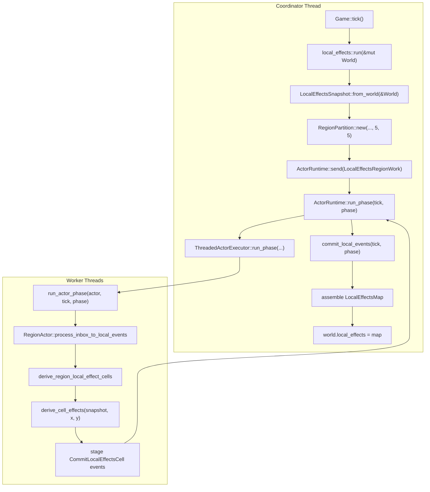
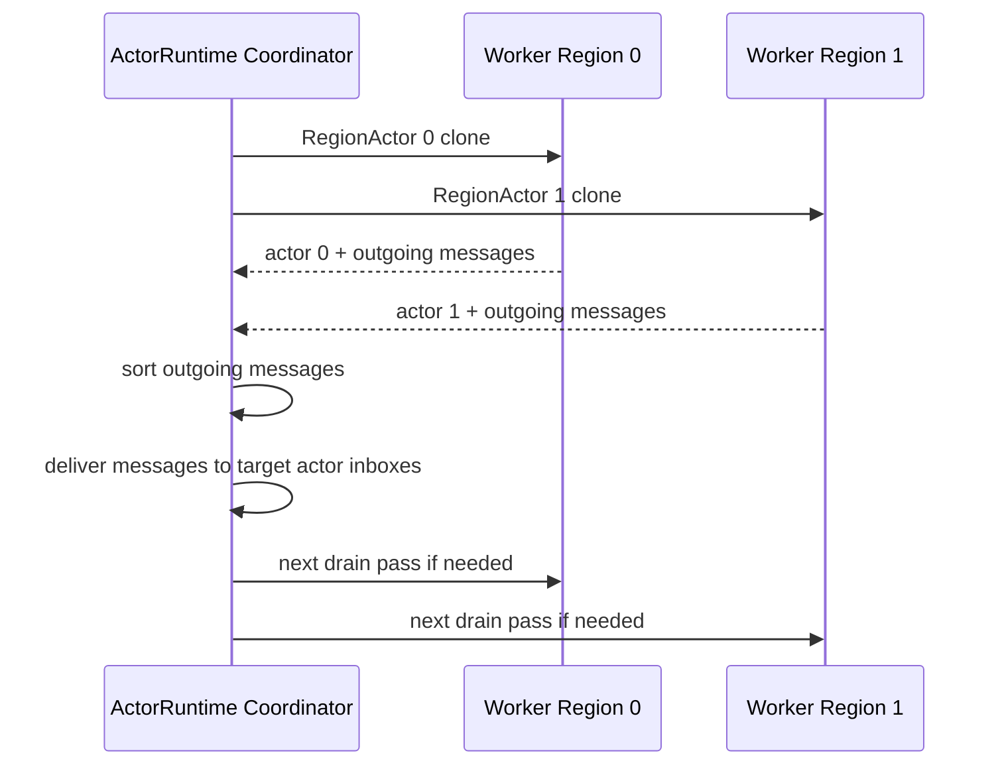
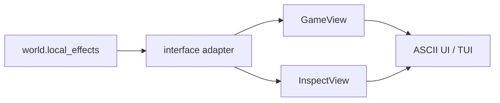

# Local Effects Threading Model

## The Big Idea

Local effects now use worker-side region computation.

`Game` still owns the ECS `World`. Worker threads do **not** receive `World`.
Instead, the coordinator builds a read-only `LocalEffectsSnapshot`, gives each
region actor one region job, and workers calculate the cells inside their own
region.

```text
Coordinator thread:
  World -> LocalEffectsSnapshot -> LocalEffectsRegionWork messages

Worker threads:
  LocalEffectsRegionWork -> derive local effects for region cells

Coordinator thread:
  committed actor cells -> LocalEffectsMap -> world.local_effects
```

This means the expensive per-cell calculation is no longer done by the
coordinator in the normal actor path.

## Which Functions Run On Which Thread

| Function / Step | Runs On | What It Does |
|---|---|---|
| `Game::tick` | Coordinator | Runs the fixed tick order. |
| `local_effects::run` | Coordinator | Entry point for refreshing `world.local_effects`. |
| `LocalEffectsSnapshot::from_world` | Coordinator | Copies only the needed read-only data out of `World`. |
| `RegionPartition::new` | Coordinator | Splits the map into `5x5` regions. |
| `ActorRuntime::send` | Coordinator | Sends one `LocalEffectsRegionWork` message to each region actor. |
| `ActorRuntime::run_phase` | Coordinator | Starts the actor phase and later commits results. |
| `ThreadedActorExecutor::run_phase` | Coordinator starts it | Spawns worker threads for actor phase work. |
| `run_actor_phase` | Worker | Runs one actor clone for the opened tick/phase. |
| `RegionActor::process_inbox_to_local_events` | Worker | Processes region messages. |
| `derive_region_local_effect_cells` | Worker | Loops over cells in one region. |
| `derive_cell_effects` | Worker | Calculates one cell's local effects from the snapshot. |
| `RegionActor::commit_local_events` | Coordinator | Commits staged actor events after workers finish. |
| Assemble `LocalEffectsMap` | Coordinator | Copies committed actor cells into `world.local_effects`. |

## Function Flow Diagram



The important line is:

```text
derive_cell_effects(snapshot, x, y)
```

That runs inside worker-side actor processing.

## What Data Crosses The Thread Boundary

Workers do not borrow ECS storage. The coordinator sends actor clones that
contain messages.

The work sent into workers is:

```text
PhaseWork {
  tick,
  phase,
  actors: Vec<RegionActor>,
}
```

For local effects, each `RegionActor` inbox contains one message:

```text
RegionMessageKind::LocalEffectsRegionWork(LocalEffectsRegionWork {
  bounds,
  snapshot: Arc<LocalEffectsSnapshot>,
})
```

The snapshot contains only copied, read-only data:

```text
LocalEffectsSnapshot {
  width,
  height,
  roads: Vec<bool>,
  buildings: Vec<BuildingEffectSample>,
  citizens: Vec<CitizenEffectSample>,
}
```

The work returned from workers is:

```text
PhaseResult {
  actors: Vec<RegionActor>,
  outgoing: Vec<RegionMessage>,
  statuses,
}
```

The computed local-effect cells are not returned as a separate global buffer.
They are staged inside each returned actor as `CommitLocalEffectsCell` events,
then committed by the coordinator.


## How Worker Threads Communicate

Worker threads do not directly call each other.

All communication goes through `ActorRuntime` on the coordinator thread.



For local effects today, workers normally produce no outgoing messages. They
only compute cells for their own region.

Future systems can use outgoing `RegionMessage` values for cross-region
requests. Even then, workers still do not directly share memory or call each
other. The runtime collects, sorts, and delivers messages deterministically.

## Why Cross-Region Effects Still Work

Local effects can cross region borders because every worker receives the same
global read-only snapshot.

Example:

```text
Region 0 owns x = 0..4
Region 1 owns x = 5..9

Park is at x = 4
Cell to calculate is x = 5
```

The Region 1 worker can see the park in the snapshot, so it can correctly apply
the park effect to its own x=5 cell. It does not need to ask Region 0.


## Local Effects Formula

Both the actor path and fallback path use:

```text
derive_cell_effects(&LocalEffectsSnapshot, x, y)
```

The formula is unchanged:

- adjacent roads add accessibility
- parks increase nearby land value
- industrial buildings add pollution pressure and reduce land value
- commercial buildings add a small land value boost
- happy nearby citizens increase land value
- unhappy nearby citizens add pollution pressure and reduce land value
- land value, pollution pressure, accessibility, and desirability are clamped

The direct fallback uses the same snapshot and the same formula, so tests can
compare actor output against direct output without duplicating the rules.

## Tick Integration

`Game::tick()` still calls local effects twice.

```text
Game::tick
  power::run
  stats::run
  local_effects::run        first pass
  daily/weekly systems
  citizens::update_happiness
  local_effects::run        second pass
  refresh_actor_runtime     border-pollution shadow only
  economy/business systems
  stats/pollution/happiness
  turn += 1
```

The first pass refreshes desirability before weekly population growth can read
it. The second pass refreshes local effects after citizen happiness changes.

After the second pass, `world.local_effects` is the final map used by views,
inspect output, overlays, economy rent calculations, and later systems.

## UI Boundary

The UI does not know actors exist.



The UI still uses only:

```text
Game::view()
Game::view_with_overlay(...)
Game::inspect(x, y)
```

It never reads `World`, `ActorRuntime`, `RegionActor`, worker queues, or actor
events.

## Fallback

If actor execution does not complete for every region, local effects fall back
to direct snapshot calculation:

```text
derive_local_effects_with_region_actors
  -> build LocalEffectsSnapshot
  -> run region actors
  -> if any phase result is not Completed
  -> derive_local_effects_direct_from_snapshot
```

This keeps gameplay functional while preserving the exact same formula.

## Determinism Rules

The threaded path is deterministic because:

- snapshot data is immutable during actor execution
- every work message belongs to one `(SimTick, SimPhase)`
- inboxes are sorted before processing
- local events are sorted before commit
- region-local cell results are sorted by `(y, x)`
- returned actors are sorted by actor id
- commits happen only at the coordinator-controlled phase boundary

Worker scheduling can change when threads finish, but it should not change the
final `LocalEffectsMap`.
